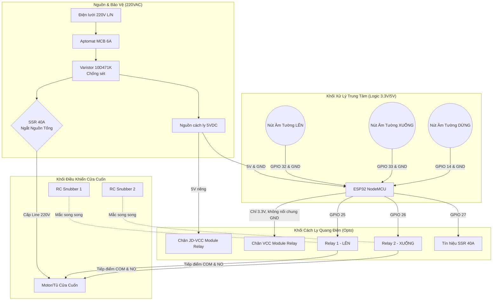

# Hướng Dẫn Đấu Nối Phần Cứng (Hardware Wiring)

Tài liệu này mô tả chi tiết cách đấu nối hệ thống IOT MyDoor đạt chuẩn công nghiệp, sử dụng các linh kiện bảo vệ (RC Snubber, Varistor) và cách ly quang điện (Optocoupler) để đảm bảo tuổi thọ 10 năm.

## 1. Sơ đồ khối tổng quát

Sơ đồ dưới đây (Mermaid) sẽ tự động render thành hình ảnh đồ họa trên GitHub, thể hiện tư duy kiến trúc rõ ràng trong CV của bạn:

---

## 2. Chi tiết Đấu Nối Khối Điều Khiển (ESP32 & Relay)

Dựa trên các linh kiện thực tế bạn đã mua (ESP32-WROOM, Module Relay 5V 4 Kênh có Opto):

### 2.1. Đấu nối Nguồn & Cách ly quang (Tuyệt chiêu công nghiệp)
Trên Module Relay 4 Kênh của bạn (như trong ảnh) có một Jumper (cầu đấu) ghi là `JD-VCC` và `VCC`. Mặc định Jumper này đang cắm.
**Để hệ thống sống 10 năm mà ESP32 không bao giờ bị nhiễu reset khi Relay đóng cắt, chúng ta phải "Cách ly quang hoàn toàn" (Total Opto-isolation):**

1.  **RÚT BỎ** Jumper nối giữa `JD-VCC` và `VCC` trên mạch Relay vứt đi.
2.  Chân `VCC` của dãy pin IN1-IN4: Nối vào chân **3V3** của ESP32.
3.  Chân `GND` của dãy pin IN1-IN4: **ĐỂ TRỐNG** (Tuyệt đối không nối vào GND của ESP32).
4.  Chân `JD-VCC` (nằm riêng): Nối vào cực dương **+5V** của bộ nguồn (Nguồn công suất).
5.  Chân `GND` (nằm cạnh JD-VCC): Nối vào cực âm **GND** của bộ nguồn (Nguồn công suất).
6.  *Kết quả:* Tín hiệu từ ESP32 chỉ thắp sáng con LED bên trong con Opto (photocoupler), điện áp 5V của cuộn hút Relay hoàn toàn tách biệt khỏi ESP32.

### 2.2. Đấu nối Tín hiệu Điều khiển
*   **Chân IN1 (Relay 1 - Cửa Lên):** Nối với chân `GPIO 25` của ESP32.
*   **Chân IN2 (Relay 2 - Cửa Xuống):** Nối với chân `GPIO 26` của ESP32.
*   **Chân kích SSR 40A (+):** Nối với chân `GPIO 27` của ESP32.
*   **Chân kích SSR 40A (-):** Nối với chân `GND` của ESP32.

### 2.3. Đấu nối Nút Bấm Âm Tường (Input)
Sử dụng điện trở kéo lên nội bộ (INPUT_PULLUP) của ESP32, nên bạn chỉ cần chập chân GPIO xuống GND khi bấm nút:
*   **1 dây chung (COM)** từ 3 nút bấm nối vào chân `GND` của ESP32.
*   **Dây Nút Lên:** Nối vào `GPIO 32`.
*   **Dây Nút Xuống:** Nối vào `GPIO 33`.
*   **Dây Nút Dừng:** Nối vào `GPIO 14`.

---

## 3. Chi tiết Đấu Nối Khối Công Suất 220V & Bảo Vệ

Đây là phần thể hiện tư duy "Kỹ sư cơ điện tử" thực thụ, áp dụng các linh kiện bạn đã mua (Varistor, RC Snubber):

### 3.1. Mạch bảo vệ Sét và Quá áp (Varistor 10D471K)
*   **Vị trí:** Mắc song song giữa hai dây L (Lửa) và N (Nguội) của lưới điện 220VAC, NGAY SAU Aptomat (MCB).
*   **Tác dụng:** Khi có sét đánh lan truyền hoặc điện áp vọt lên >470V, Varistor sẽ ngắn mạch (chập L vào N), làm nhảy Aptomat bảo vệ lập tức, cứu sống toàn bộ bo mạch phía sau.

### 3.2. Mạch cắt nguồn an toàn (SSR 40A)
*   Cắt đứt dây L (Lửa) của lưới điện đi vào Motor cửa cuốn.
*   Nối 2 đầu dây L vừa cắt vào 2 cọc Output (Dấu ngã `~` hoặc ghi `L1`, `T1`) của cục SSR 40A.
*   Ban đêm hoặc khi nghỉ, SSR ngắt mạch -> Motor mất điện hoàn toàn. Khi bấm chạy, code sẽ kích SSR cấp điện lại trước 100ms.

### 3.3. Dập Hồ Quang (RC Snubber - Tuyệt đối quan trọng)
Do Motor cửa cuốn là một tải cảm cảm rất lớn (Cuộn dây), khi Relay cơ khí ngắt điện sẽ sinh ra tia lửa điện (hồ quang) ở tiếp điểm, phát ra sóng EMI làm cháy tiếp điểm và reset ESP32 từ xa.
*   **RC Snubber 1 (Mạch xanh dương chữ nhật bạn đã mua):** Mắc song song vào 2 cọc (COM và NO) của Relay 1 (Cửa Lên).
*   **RC Snubber 2:** Mắc song song vào 2 cọc (COM và NO) của Relay 2 (Cửa Xuống).
*   **Tác dụng:** Khi tiếp điểm Relay nhả ra, tụ điện và điện trở trên mạch RC Snubber sẽ "nuốt" toàn bộ điện áp phản kháng của cuộn dây Motor, bảo vệ tiếp điểm vĩnh viễn không bị rỗ hay dính.