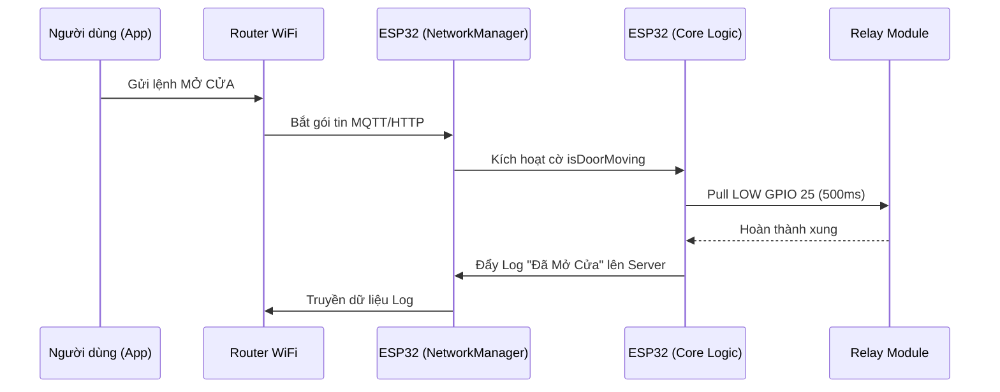

# Cấu trúc Kiến trúc Phần mềm (Software Architecture)

Dự án **MyDoor IoT** được thiết kế theo chuẩn công nghiệp với tiêu chí: **Non-blocking (Không chặn)** và **Fault-tolerant (Chống lỗi)**.

## 1. Khối Điều Khiển Lõi (Core Logic)
Nằm tại `src/main.cpp`. Khối này chịu trách nhiệm:
- Đọc trạng thái mạng từ `NetworkManager`.
- Điều khiển các Relay Lên/Xuống/Dừng bằng cách xuất xung (pulse) 500ms.
- Điều khiển Relay 4 (Nguồn Tổng) dựa trên lịch trình thời gian thực.
- **Tiêu chí:** Vòng `loop()` chính không bao giờ được phép chứa hàm `delay()` lớn hơn 50ms, đảm bảo ESP32 luôn phản hồi thao tác vật lý tức thời.

## 2. Khối Mạng & Lưu trữ (NetworkManager)
Nằm tại `src/NetworkManager.cpp`. Hoạt động song song và bất đồng bộ:
- **WiFi Auto-Reconnect:** Liên tục kiểm tra trạng thái WiFi mỗi 10 giây. Nếu mất mạng, tự động `WiFi.begin()` mà không làm treo hệ thống.
- **NVS (Non-Volatile Storage):** Sử dụng thư viện `Preferences` thay cho EEPROM cũ kỹ để lưu trữ SSID, Password, Giờ Hẹn, và Mật khẩu Admin. Dữ liệu trong NVS không bị mất khi nạp lại firmware.
- **Async Web Server:** Máy chủ Web phục vụ giao diện Cài đặt (Captive Portal) tại IP `10.10.10.1`. Do chạy bất đồng bộ trên FreeRTOS, việc người dùng load trang Web không làm ảnh hưởng đến tốc độ phản hồi của Cửa.

## 3. Kiến trúc Cập nhật Phần mềm (OTA & Dual-Boot)
Dự án sử dụng sơ đồ phân vùng ổ cứng (Partition Scheme) đặc biệt: `min_spiffs.csv`.
- **App Partition (1.9MB):** Chứa Firmware đang chạy.
- **OTA Data:** Quản lý việc chuyển đổi phân vùng khởi động.
- Người dùng truy cập `10.10.10.1/update` (cung cấp bởi thư viện `ElegantOTA`) để nạp file `.bin` mới (Ví dụ: chuyển từ Blynk sang RainMaker) qua mạng WiFi nội bộ mà không cần cắm cáp USB.

## 4. Luồng Xử Lý Sự Kiện (Event Flow)
