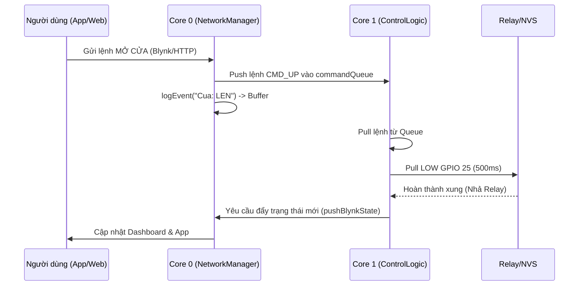

# Cấu trúc Kiến trúc Phần mềm (Software Architecture)

Dự án **MyDoor IoT** được thiết kế theo chuẩn công nghiệp (Production-ready) với tiêu chí: **Real-time**, **Non-blocking**, và **Fault-tolerant**. 

Hệ thống tận dụng sức mạnh của **FreeRTOS Dual-Core** trên ESP32 để tách biệt hoàn toàn luồng xử lý Mạng (Network) và Điều khiển Phần cứng (Hardware Control), triệt tiêu rủi ro Watchdog Panic hoặc chớp giật Relay khi giật lag mạng.

## 1. Phân bổ lõi xử lý (Core Allocation)

### Core 0 (PRO_CPU): Network & Web Server (`NetworkManager`)
Chịu trách nhiệm toàn bộ các giao thức bất đồng bộ (Asynchronous):
- **WiFi Stack:** Quản lý kết nối STA (kết nối router) và SoftAP (Rescue AP phát tự động khi mất mạng).
- **Async WebServer:** Chạy Captive Portal tại `10.10.10.1` để nạp cấu hình và hiển thị Dashboard. Không chặn luồng chính.
- **Blynk IoT & NTP:** Duy trì kết nối Cloud (MQTT/SSL) và lấy thời gian thực.
- **ElegantOTA:** Cập nhật Firmware Over-The-Air thông qua phân vùng `min_spiffs.csv` (App Partition 1.9MB).

### Core 1 (APP_CPU): Hardware Control (`ControlLogic`)
Luồng ưu tiên cao (High Priority) chuyên biệt cho phần cứng:
- **Relay Control:** Xuất xung (pulse) chính xác 500ms cho các lệnh Lên/Xuống/Dừng.
- **Interrupt Service Routines (ISR):** Lắng nghe sự kiện nút bấm cứng (Boot, Reset, Nút Đèn) qua ngắt (Falling edge) với logic debounce cơ bản.
- **Scheduler:** Đóng/cắt Nguồn Tổng (Relay 4) và Đèn (Relay 5) dựa trên giờ lấy từ Core 0.

## 2. Giao tiếp Liên lõi (Inter-task Communication)
- **Message Queue (`commandQueue`):** Các lệnh Mở/Đóng/Dừng từ WebUI hoặc Blynk (Core 0) được đẩy vào Queue. Core 1 sẽ lấy ra xử lý tuần tự. Nếu Queue đầy, lệnh bị rớt có kiểm soát (Log cảnh báo), tránh kẹt bộ nhớ.
- **Mutex (`timeMutex`):** Biến lưu trữ giờ hiện tại (`currentHour`, `currentMin`) được bảo vệ bằng Semaphore. Core 0 (NTP) ghi vào và Core 1 (Scheduler) đọc ra một cách an toàn tuyệt đối (Thread-safety).

## 3. Quản lý Bộ nhớ (Memory Management)
- **NVS (Non-Volatile Storage):** Lưu trữ cấu hình (WiFi, Blynk Auth, Schedule, Admin Auth) qua thư viện `Preferences`.
- **Wear Leveling:** Kỹ thuật **Dirty Flag** đảm bảo Flash chỉ bị ghi (Write) khi trạng thái thực sự thay đổi, kéo dài tuổi thọ bộ nhớ ROM.
- **Self-Healing (Tự phục hồi):** Hardware WDT (8s) và hàm `monitorHeap()` liên tục giám sát. Nếu Free RAM < 20KB, hệ thống tự động Reboot để chống tràn bộ nhớ (Memory Leak).

## 4. Luồng Xử Lý Sự Kiện (Event Flow)
